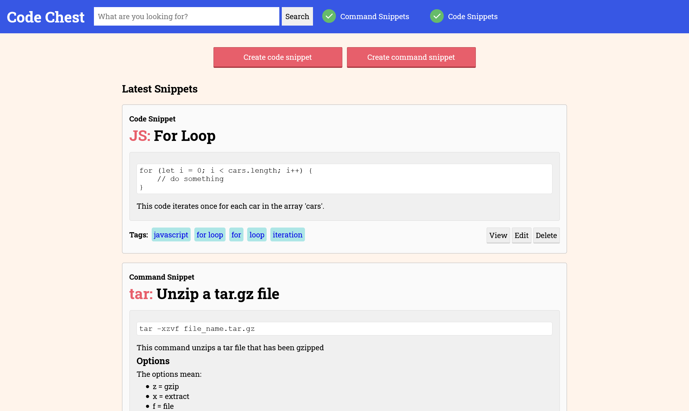

# CodeChest - DEVS Hackathon 2021
***Problem Statement:** Commands can be unintuitive and hard to remember.*

CodeChest is a library of high quality examples for common one-off tasks - put simply, a software manual that gets straight to the point.



CodeChest was built for the 2021 DEVS Hackathon in Auckland.

You can view the slides used during the presentation here: [hackathon-slides.pdf](https://github.com/mjakeman/devs-hackathon-2021/blob/master/hackathon-slides.pdf)

## Technologies
The following technologies were used:
 * NodeJS + Express web server
 * MongoDB for data storage
 * EJS (embedded javascript) for serving the website

## Building
To build and run the webapp, make sure you have NodeJS 14.x and MongoDB installed.

```
# Clone repository
git clone https://github.com/mjakeman/devs-hackathon-2021
cd devs-hackathon-2021

# Install Dependencies
npm install

# Start the dev server
npm run dev
```
